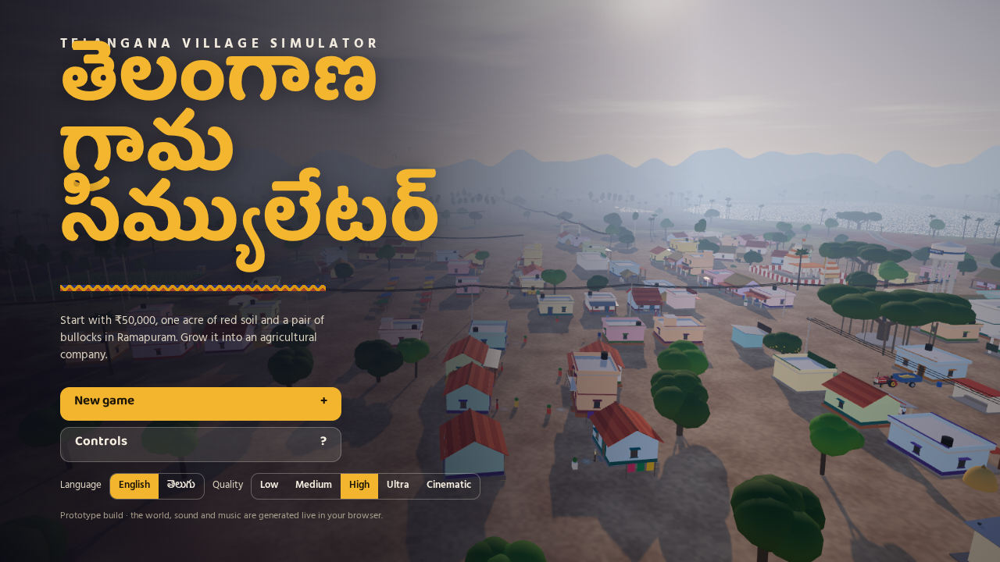
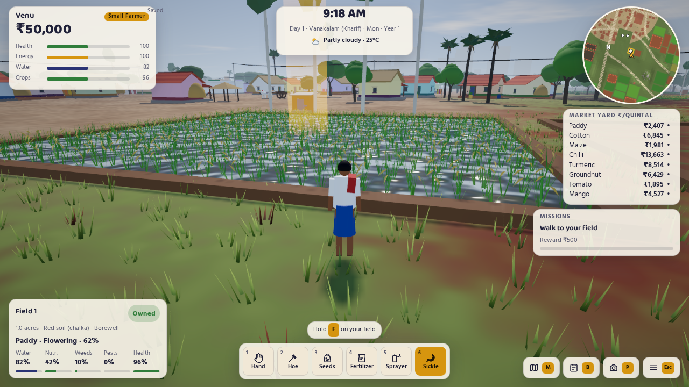
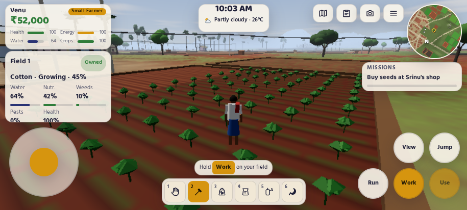
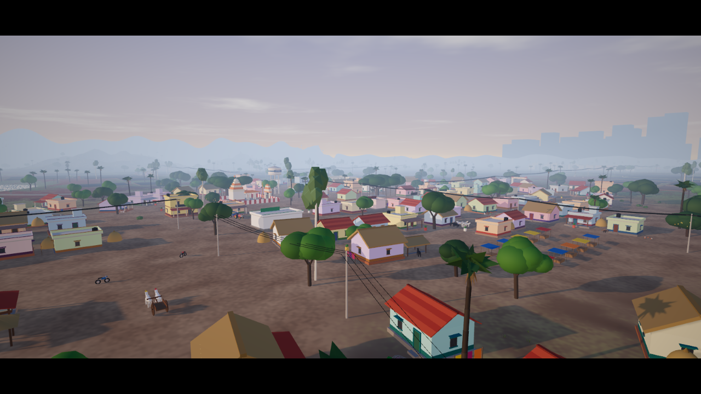

# Telangana Village Simulator · తెలంగాణ గ్రామ సిమ్యులేటర్

A 3D open-world farming game set in a Telangana village. You start in Ramapuram with ₹50,000, one acre of red soil, a pair of bullocks and a small house. Grow paddy, cotton and chilli, sell at the market yard, and build your farm into an agricultural company.

₹50,000, ఒక ఎకరం ఎర్ర నేల, ఒక ఎడ్ల జతతో రామాపురంలో మొదలుపెట్టండి. దాన్ని వ్యవసాయ కంపెనీగా ఎదిగించండి.

It runs in the browser on PC and on phones, in English and Telugu. There is nothing to install.



| Your field | On a phone |
| --- | --- |
|  |  |



## Play

**Play now: <https://peru-dove-641366.hostingersite.com>** (free, nothing to install)

Works on Android phones, iPhones, iPads, tablets and computers, in any modern browser (Chrome, Safari, Edge, Firefox).

- **iPhone / iPad:** open the game in Safari, tap **Share → Add to Home Screen**, then start it from the home screen. It opens full screen like an app.
- **Android:** the game goes full screen when you tap Start. You can also use Chrome's **Install app / Add to Home screen**.
- **Turn the phone sideways** for the best view. Phones start on the Low quality setting so the game stays smooth.
- **Just follow the coach:** the yellow strip at the bottom and the mission card always say the next step ("Go to your field", "Hold Work", "Tap Buy seeds"), and the gold arrow shows the way. The steps can also be read aloud (Menu → Voice guide).
- **Stuck? Tap "▶ Do it for me":** your farmer walks to the next place along the roads, works the whole field row by row, taps the right button or rests until the crop needs you. Touch the stick to take control back. On a touch screen you can also tap the ground to walk there.

- **Online:** once GitHub Pages is turned on for this repository (Settings → Pages → Deploy from branch → `main`, folder `/root`), the game is at `https://venuikkada.github.io/Telangana-village-simulator-/`.
- **On your computer:** open `index.html` in Chrome, Edge or Firefox. An internet connection is needed the first time, for three.js and the fonts. If your browser blocks it, run `npx serve .` in this folder and open the address it prints.

## What's in the game

- **The world:** Ramapuram village with its temple, school, panchayat office, tea stall, seed shop, kirana, tractor workshop, health centre and weekly santha. There is also the smaller village of Seethampet, Nagaram town with the bank and tractor showroom, the agricultural market yard, a highway with a petrol bunk and dhaba, the lake, the canal, borewells, granite hills, palm and neem trees, power lines and transformers.
- **Farming:** plough, cultivate, sow, irrigate with the borewell pump or the canal gate, fertilize, weed, spray pests and harvest. Each field tracks water, nutrients, weeds, pests and crop health. Red and black soils suit different crops.
- **Crops:** paddy, cotton, maize, chilli, turmeric, groundnut and tomato, plus a mango orchard.
- **Seasons and weather:** Vanakalam (Kharif), Yasangi (Rabi) and Endakalam (Summer). Weather includes monsoon rain, thunderstorms with lightning, heat waves, gusty winds, morning mist, droughts and power cuts. There is a full day and night cycle with moon phases.
- **Selling and money:** prices move with supply, demand, the season and news events. You can sell at the market yard, at MSP at the government procurement centre (paid after two days), to the village trader or at the Sunday santha. Store your harvest at home or in a warehouse or cold storage, but it can spoil. Bank crop loans, the moneylender and the farmer investment support payment are all there.
- **Machines:** a bullock cart and wooden plough, an old moped, a motorcycle, two tractors, a pickup van and a combine harvester. Tractor implements are the MB plough, cultivator, rotavator, seed drill, fertilizer spreader, boom sprayer, trailer and water tanker. You can also rent a tractor or hire a combine harvester.
- **Growing the farm:** buy or lease land in two villages and drill borewells. Upgrade the house through five levels, from a small village house to an agricultural estate. Build a water tank, farm pond, solar pump, warehouse, cold storage, polyhouse, dairy shed, machinery garage and worker quarters.
- **Workers:** daily labourers, permanent farmhands and tractor drivers who take your tractor to the field.
- **Village development:** fund CC roads, street lights, a drinking water tank, a shopping complex, a school, the health centre, canal lining, a village godown and a market expansion.
- **Ranks:** Small Farmer → Successful Farmer → Large Farmer → Agricultural Business Owner → Village Agribusiness → Agricultural Company.
- **Missions:** an eight-step tutorial, then missions that adapt to your farm, plus pest attacks, droughts and the festivals Bonalu, Bathukamma, Sankranti and Ugadi.
- **Village life:** up to about 70 villagers with daily routines, including the sarpanch, the seed shop owner, the mechanic, the doctor, the moneylender and the shepherd. There are cattle, buffaloes, goats, sheep, dogs, chickens and birds, plus buses, lorries, autos and motorbikes on the roads.
- **Sound:** wind, rain, crickets, temple bells, engines and animals, and music that follows the time of day. All of it is generated live in the browser.
- **Easy to play:** one Auto button does the next job on your field: plough, sow, water, feed, weed, spray or harvest. Missing seeds or fertilizer? One tap gets them delivered to the field. When the crop is growing, "Rest" jumps ahead to the next thing it needs.
- **Never lost:** a gold arrow and an on-screen marker always point to your next goal. The minimap faces north and shows shops, roads and your fields. On the full map, tap any place and take an auto straight there.
- **Graphics:** Low, Medium, High, Ultra and Cinematic presets. Phones start on Low and run at a steady 60 or 30 FPS ("Auto" picks what the phone can hold). Far trees and fields switch to lighter models, and resolution adjusts automatically to keep the game smooth.
- **Easy mode:** new games start in Easy mode, made for kids and first-time players: crops dry out, get weedy and catch pests about half as fast, a neglected crop still gives a fair harvest, and the farmer tires more slowly. Switch between Easy and Normal any time in the Menu.
- **How to play:** four picture cards the first time you play (Move, Follow the gold arrow, Do it for me, Gifts & trophies). Open them again from the Menu.
- **Daily gift:** come back every day for a gift that grows over a 7-day streak, from ₹1,000 and fertilizer to seeds and ₹10,000 on day 7.
- **Trophies:** 21 trophies, from "First seeds" and "Lakhpati" to "Tractor owner" and "Crorepati", each with a cash reward. See them in Farm office → Trophies.
- **Your own dog:** adopt Moti, Kalu or Tommy at your house for free. Your dog follows you everywhere, even beside your tractor, and patting it gives you energy.
- **Photos and sharing:** photo mode has a Take photo button. The picture gets the game's name and link and can be saved, shared or sent on WhatsApp. "Invite friends" in the Menu shares the game link.
- **Saving:** the game saves every morning, after you sleep and every few minutes. On claude.ai your farm can also save to your account, so you can continue on another device.

## Controls

| PC | Phone | Action |
| --- | --- | --- |
| W A S D | Left stick | Walk or drive |
| Shift | Run, or push the stick all the way | Run |
| Mouse drag, wheel | Drag the screen, pinch | Look around, zoom |
| E | Use, or tap the prompt | Talk, use shops, buy seeds, rest, get in and out of vehicles |
| F (hold) | Work (hold) | Auto: does the next job on your field |
| 1 – 6 | Tool bar | Auto, hoe, seeds, fertilizer, sprayer, sickle |
| Q | Type | Switch seed, fertilizer or spray |
| G | Lower / Raise | Lower or raise the implement |
| H / L | Horn | Horn / headlights |
| V | View | First or third person |
| M, B, P, Esc | Top buttons | Map, farm office, photo mode, menu |
| Enter | ▶ Do it for me | The game does the next step for you |
| – | Tap the ground | Walk there |

Follow the gold arrow. Sleep at home to skip the night, or use "Rest" on your field while the crop grows.

## Build from source

```bash
npm install
npm run build     # writes index.html and dist/
npm run check     # build + syntax check + lint
```

The browser tests drive the game in headless Chromium. They need Playwright's Chromium: run `npx playwright install chromium` once, then `npm test` or `npm run test:mobile`.

## Project layout

| File | What it does |
| --- | --- |
| `src/page.html` | Page shell: styles, HUD, menus, touch controls, title and loading screens |
| `src/js/00_core.js` | three.js import, maths, seeded random, noise, language and money helpers, event bus |
| `src/js/01_data.js` | Seasons, festivals, weather, crops, items, machines, upgrades, ranks, names |
| `src/js/02_render.js` | Renderer, quality presets, shared shader effects, post-processing |
| `src/js/03_sky.js` | Sky, sun and moon, day and night lighting, fog, lightning |
| `src/js/04_terrain.js` | Terrain, field layout, roads, lake, canal, collisions |
| `src/js/05_builder.js` | Geometry builder, world chunks, Telugu sign boards |
| `src/js/06_buildings.js` | Houses, temple, school, shops, workshop, market yard and other buildings |
| `src/js/06b_village.js` | Places Ramapuram, Seethampet, Nagaram town and the landmarks |
| `src/js/07_vegetation.js` | Trees, grass, boulders |
| `src/js/08_fields.js` | Field tiles, crop growth, water, nutrients, weeds, pests |
| `src/js/09_characters.js` | People, animals and birds with procedural animation |
| `src/js/10_npc.js` | Road paths, villager routines, animal behaviour |
| `src/js/11_vehicles_models.js` | Tractor, harvester, bike and implement models |
| `src/js/11b_vehicles.js` | Driving, implements, traffic, AI field work, particles |
| `src/js/12_player.js` | Input, player, cameras, interactions |
| `src/js/12b_auto.js` | "Do it for me" autopilot and tap-to-walk |
| `src/js/13_time_weather.js` | Clock, calendar, weather, rain |
| `src/js/14_economy.js` | Money, market prices and news, storage, loans |
| `src/js/14b_farm.js` | Land, house, upgrades, dairy, workers, village projects, services, ranks |
| `src/js/14c_extras.js` | Daily gift, trophies, pet dog, photo sharing, easy mode, how-to-play cards |
| `src/js/15_missions.js` | Tutorial and generated missions |
| `src/js/15b_coach.js` | Step-by-step coach, gold guide arrow, spoken instructions |
| `src/js/16_audio.js` | Ambience, spatial sounds, engines, music |
| `src/js/17_ui.js` | HUD, map, menus, shops, dialogue, settings, touch controls |
| `src/js/18_save.js` | Browser and cloud saves |
| `src/js/19_main.js` | World build, game start, simulation clock, main loop |
| `tools/build.mjs` | Joins everything into `index.html` |
| `tools/*.cjs` | Headless browser tests and screenshot scripts |

The only libraries are [three.js](https://threejs.org) 0.170, loaded from jsDelivr, and the Google Fonts Baloo Tammudu 2 and Hind Guntur. Every model, texture, sound and piece of music is generated in code, so the game has no image or audio files.

---

© 2026 venuikkada. All rights reserved.
